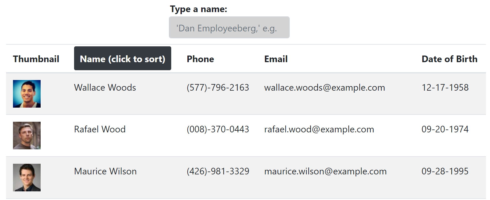

# React Employee Directory
An employee tracking system built with React

[Live Demo](
https://frank-merk.github.io/react-employee-directory/)

## Technologies used

* React Framework
* Github pages deployment
* Axiom and Random User API
* Bootstrap

## Description

This week's homework assignment was to create a searchable employee tracking system using the React framework. User data is automatically generating from the random user API and rendered to the page using all the tools afforded to us by React.
  
## Installation

First, install dependendencies:

`npm install`

To run the application from the terminal, you will enter:

`npm start`

## Strategy

Since there was no starter code, the first thing I did was set up the scaffolding for the react app from the command line. From there, I sketched out how the dashboard would look and populated with boilerplate data from past projects and bootstrap elements. 

## Challenges

The first challenge was data-handling because there was no seedlist. The randomuser.me API solved this first challenge. Previou exercises were helpful in setting up the page and data structure and rendering that to the page. The most difficult aspect was the sorting functionality. The logic was tricky to parse out in terms of how to go about sorting alphabetically and based on user input. Thankfully, there was a previous exercise with integers that proved to be a useful guidepost. 

## License

[Apache 2.0](https://opensource.org/licenses/Apache2.0)

## Questions

For further questions, contact here:
* Email Address: jlimhb@gmail.com
* GitHub: [frank-merk](https://github.com/frank-merk)
